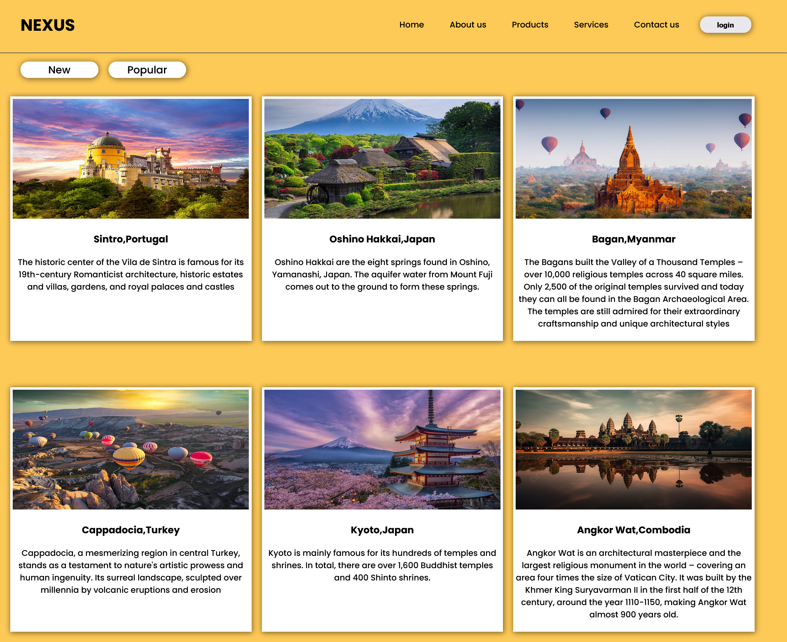

# 🌍 Nexus Travel – Flexbox Landing Page

Welcome to **Nexus Travel**, a modern and responsive travel-themed landing page built using **HTML and CSS Flexbox**. This project is perfect for beginners practicing layout design or developers building their portfolio.

<hr/>

## 📸 Preview

  

<hr/>

## 🚀 Features

- 🔥 Clean, modern, and responsive design
- 💪 Built 100% with HTML5 and CSS3
- ⚙️ Powered by CSS **Flexbox** for layout structure
- 📱 Mobile-friendly layout
- 🏝️ Includes real-world exotic travel destinations
- 💡 Great for web dev practice and portfolio projects
<hr/>

## 🛠️ Tools Used

- HTML5
- CSS3
- Flexbox
- Google Fonts

<hr/>

## 📂 Folder Structure

```
nexus-travel/
│
├── index.html
├── style.css
├── images/
│ ├── 1.jpg
│ ├── 2.jpg
│ └── ...
└── README.md
```

<hr/>

## 🎬 Video Preview

Get a quick tour of the Nexus Travel Landing Page in action!  
Watch the video to see how Flexbox flexes its muscles 💪🌍

[](https://youtu.be/IeN6CDXB1Rk)

<hr/>

## 🚀 Live Demo

Wanna see it in action without touching your keyboard? Click below 👇  
Live now on GitHub Pages:

🔗 [Nexus Travel Landing Page - Live Demo](https://rakesh12531.github.io/nexus-travel/)

<hr/>

## 💡 What I Learned

- Flexbox layout techniques
- Responsive design using media queries
- Improving UI design for better UX
- Building clean and structured HTML/CSS code
  
<hr/>

## 🤝 Connect With Me

- 💼 [LinkedIn](https://linkedin.com/in/rakesh531)
- 🧠 [GitHub](https://github.com/Rakesh12531)

<hr/>

## 📜 License

This project is open-source and free to use for learning and inspiration.

<hr/>

> “Travel the web. Code your journey.” – *Nexus Dev Team*

<hr/>

